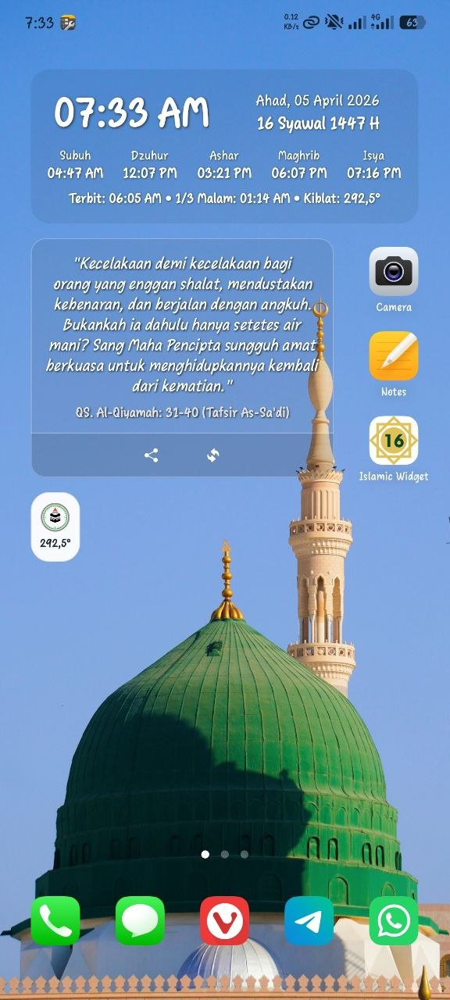
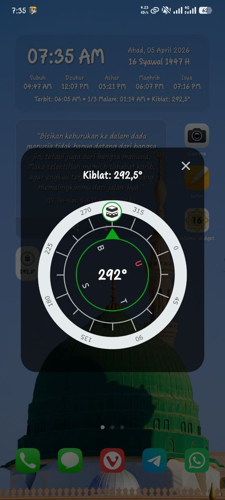
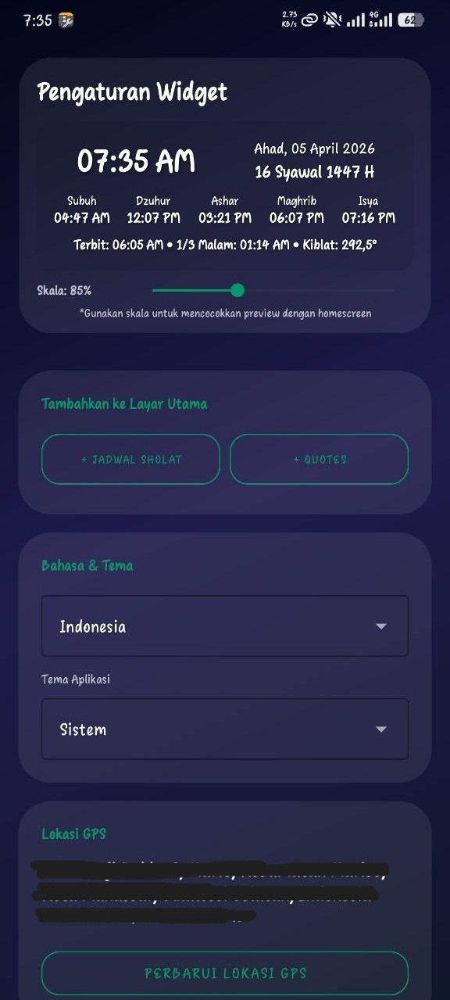
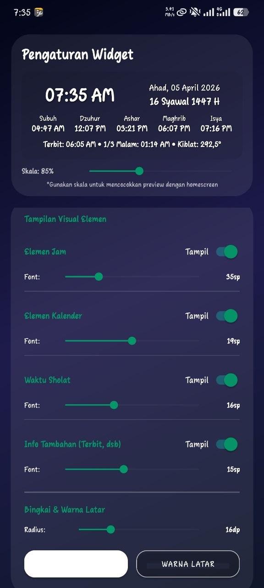
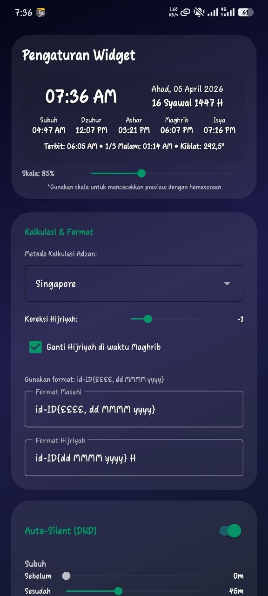
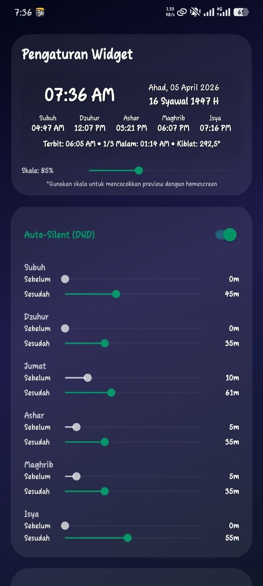
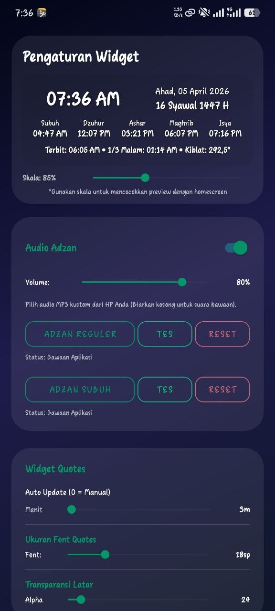
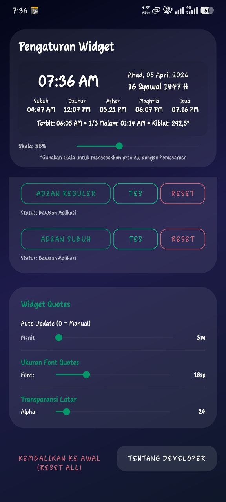

# Islamic Widget

  
  
  
  

  
  
  
  

A comprehensive Islamic Widget application for Android that provides accurate prayer times, a Qibla compass, robust Adzan notifications, and daily Sunnah reminders right on your Home Screen.

## ✨ Key Features

### 🕌 Prayer Times & Smart Adzan
* **Accurate Calculation:** Supports various global prayer time calculation methods (Muslim World League, Egyptian, Karachi, Umm Al-Qura, etc.) based on your GPS coordinates.
* **Robust Anti-Pause Adzan:** The Adzan audio is guaranteed to play completely even when the screen is off. It includes a Battery Optimization Bypass request for aggressive vendors (e.g., MIUI/HyperOS, ColorOS).
* **Instant & Smooth Interruptions:** Stop the Adzan sound instantly by tapping the notification on the Lock Screen or simply by pressing the physical Power button. It features a smooth fade-out effect so the audio doesn't stop abruptly.
* **Auto Friday Mode:** The system automatically skips the Dhuhr Adzan audio on Fridays to prevent disruptions during Jumu'ah prayers at the mosque.
* **Auto-Silent (Do Not Disturb):** Automatically switches your phone to Vibrate/Silent mode shortly before prayer times and restores the normal volume afterward.
* **Customizable Adzan Audio:** Use the built-in Adzan recitations (Fajr & Regular) or select your own custom MP3/WAV audio files from local storage.

### 🌙 Calendar & Sunnah Reminders
* **Dynamic Hijri Date:** Includes an adjustable day offset feature (+/- days) and precise automatic day-switching synchronization at Maghrib time.
* **Sunnah Fasting Reminders:** Real-time text notifications directly on the widget for Monday-Thursday fasting, Ayyamul Bidh, Ashura, Tasu'a, Arafah, Tarwiyah, and the Al-Kahfi reminder on Fridays.
* **Special Times:** Displays Sunrise time and the Last Third of the Night to help plan Tahajjud prayers.
* **Precise Localization:** Supports Indonesian, English, and Arabic. (Specifically uses the term **"Ahad"** instead of "Minggu" for the Indonesian locale).

### 🕋 Qibla Compass & Islamic Quotes
* **Accurate Qibla Compass:** Integrated with the device's gyro/magnetometer sensors to accurately point towards the Kaaba directly from a tap on the widget.
* **Quotes Widget:** Display Quranic verses, Hadiths, or Salaf advice that rotate automatically based on your custom time intervals.

### 🎨 Full UI Customization
* Freely customize the text color and background color (supports alpha/transparency via a built-in Color Picker).
* Adjust the widget's corner radius.
* Modify the overall scale and specific font sizes for the main clock, date texts, and prayer times to perfectly fit your Android Home Screen.

## ⚙️ Permissions Used
This app requests several system permissions to provide optimal functionality:
* **Location (Precise/Approximate):** Used purely locally to calculate accurate prayer times and Qibla direction based on your position.
* **Notifications & Alarms:** Used to schedule and trigger timely Adzan notifications utilizing Full-Screen Intents.
* **Do Not Disturb (DND) Access:** Required to execute the Auto-Silent feature during prayer times.
* **Ignore Battery Optimization:** Crucial for ensuring that Adzan schedules are not forcefully killed by the OS when the app is running in the background.

## 🚀 Installation & Build
1. Clone the repository: `git clone https://github.com/cyberzilla/IslamicWidget.git`
2. Open the project in **Android Studio**.
3. Sync Gradle and build the project.
4. Run on an emulator or physical device.

## 👨‍💻 Developer
Developed by [cyberzilla](https://github.com/cyberzilla)

---
*Feel free to contribute, report issues, or suggest new features via GitHub pull requests and issues!*