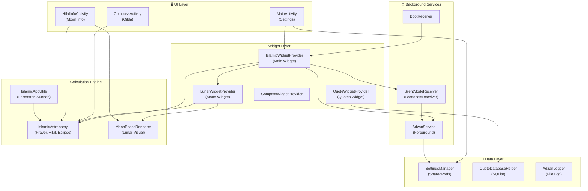
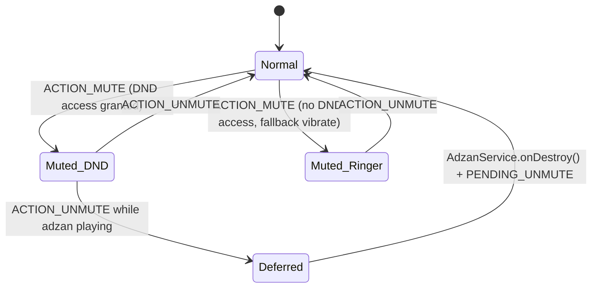

# 📋 IslamicWidget — Project Plan (End-to-End)

> **Dokumen ini menjelaskan arsitektur, modul, alur data, dan detail teknis dari project IslamicWidget secara menyeluruh — dari awal hingga akhir.**

---

## 1. Ringkasan Proyek

**IslamicWidget** adalah aplikasi Android widget yang menyediakan:
- ⏰ Waktu sholat akurat (15 metode kalkulasi)
- 🔊 Adzan audio anti-pause dengan Auto-Silent (DND)
- 🌙 Kalender Hijriah dinamis berbasis visibilitas Hilal astronomi
- 🌕 Widget fase bulan realistik dengan deteksi gerhana
- 🕋 Kompas Qibla (gyro + magnetometer + declination correction)
- 📜 Widget kutipan Islami (Quran, Hadits, Salaf)
- 🎨 Full UI customization (warna, font, radius, skala)
- 🌐 Lokalisasi 3 bahasa (Indonesia, English, العربية)

---

## 2. Struktur Proyek

```
IslamicWidget/
├── app/src/main/java/com/cyberzilla/islamicwidget/
│   ├── MainActivity.kt              ← Settings UI utama (1339 baris)
│   ├── IslamicWidgetProvider.kt      ← Widget utama + alarm scheduler (970 baris)
│   ├── LunarWidgetProvider.kt        ← Widget fase bulan (215 baris)
│   ├── QuoteWidgetProvider.kt        ← Widget kutipan Islami (163 baris)
│   ├── CompassWidgetProvider.kt      ← Widget shortcut kompas (kecil)
│   ├── CompassActivity.kt           ← Qibla compass full-screen (324 baris)
│   ├── HilalInfoActivity.kt         ← Dialog info Hilal + fase bulan
│   ├── AdzanService.kt              ← Foreground service audio adzan (574 baris)
│   ├── SilentModeReceiver.kt        ← BroadcastReceiver MUTE/UNMUTE/ADZAN (259 baris)
│   ├── BootReceiver.kt              ← Re-schedule alarm setelah reboot
│   ├── SettingsManager.kt           ← SharedPreferences wrapper (324 baris)
│   ├── IslamicAppUtils.kt           ← Utility: prayer times, sunnah info, formatting
│   ├── AudioAdzanManager.kt         ← Test adzan audio di settings
│   ├── AdzanLogger.kt               ← Diagnostic logging ke file (312 baris)
│   ├── DeveloperModeHelper.kt        ← Developer debug tools (DEBUG only)
│   ├── IconHelper.kt                ← Dynamic launcher icon per tanggal Hijriah
│   ├── QuoteDatabaseHelper.kt       ← SQLite helper untuk kutipan
│   ├── QuoteUpdateManager.kt        ← AlarmManager untuk auto-rotate kutipan
│   ├── UpdateHelper.kt              ← OTA update checker via GitHub
│   ├── UpdateReceiver.kt            ← Download & install APK update
│   ├── WidgetPinReceiver.kt         ← Callback pin widget
│   ├── TopFadingNestedScrollView.kt ← Custom scroll view
│   └── utils/
│       ├── IslamicAstronomy.kt      ← Engine astronomi: sholat, hilal, gerhana (650 baris)
│       ├── MoonPhaseRenderer.kt     ← Render bulan realistik + gerhana (602 baris)
│       └── astronomy.kt            ← Library astronomy-engine (~240KB)
├── app/src/main/res/
│   ├── layout/                      ← 15 layout XML
│   ├── drawable/, drawable-night/, drawable-nodpi/
│   ├── raw/                         ← Audio adzan (subuh + regular)
│   ├── values/, values-ar/, values-en/
│   ├── values-night/
│   ├── anim/
│   └── xml/                         ← Widget info + provider_paths
└── quotes/                          ← Database kutipan sumber
```

---

## 3. Arsitektur & Alur Data

### 3.1 Diagram Arsitektur Tingkat Tinggi



### 3.2 Lifecycle Alur Utama

```
Boot/Install → BootReceiver → cancelAllSilentAlarms() → triggerWidgetUpdate()
                                                              ↓
Widget Update → IslamicWidgetProvider.onUpdate()
                    ├── scheduleAllPrayers() → AlarmManager (MUTE/UNMUTE/ADZAN × 5 sholat)
                    ├── updateAppWidget() → RemoteViews render
                    └── refreshLunarWidget() → LunarWidgetProvider
                                                              ↓
Alarm Fires → SilentModeReceiver.onReceive()
                    ├── ACTION_MUTE → executeMute() (DND Priority / Ringer Vibrate)
                    ├── ACTION_UNMUTE → executeUnmute() (restore prev state)
                    └── ACTION_PLAY_ADZAN → startForegroundService(AdzanService)
                                                              ↓
AdzanService → MediaPlayer (USAGE_ALARM) + WakeLock + MediaSession
                    ├── onCompletion → fadeOutAndStop()
                    ├── Volume button → fadeOutAndStop()
                    └── onDestroy() → check PENDING_UNMUTE + isStillInsideSilentWindow()
```

---

## 4. Modul Detail

### 4.1 🕌 Prayer Times Engine (`IslamicAstronomy.kt`)

**Library:** `io.github.cosinekitty.astronomy` (astronomy-engine)

| Fitur | Detail |
|-------|--------|
| **Metode Kalkulasi** | 15 metode: Kemenag, JAKIM, Singapore, MWL, ISNA, MSC, Egyptian, Karachi, Umm Al-Qura, Dubai, Qatar, Kuwait, Tehran, Turkey, Morocco |
| **Madhab** | Shafi (shadow factor 1.0), Hanafi (shadow factor 2.0) |
| **High Latitude** | Middle of Night, Seventh of Night, Twilight Angle |
| **Waktu Dihitung** | Imsak, Fajr, Sunrise, Dhuha, Dhuhr, Asr, Maghrib, Isha |
| **Safety Offset** | Per-metode (contoh: Kemenag +2 menit) |
| **Sunnah Times** | Middle of Night, Last Third of Night |

**Alur Kalkulasi:**
1. Hitung transit matahari (solar noon) menggunakan `searchHourAngle()`
2. Fajr/Isha: `searchAltitude()` dengan sudut twilight per metode
3. Asr: Shadow factor × tan(|latitude − declination|)
4. Maghrib: Sunset + offset per metode
5. High latitude fallback jika Fajr/Isha gagal dihitung

### 4.2 🌙 Hijri Calendar & Hilal Visibility

**11 Kriteria Hilal:**

| Kriteria | Syarat Utama |
|----------|-------------|
| Neo MABIMS | Alt ≥ 3°, Elongasi ≥ 6.4° |
| MABIMS Lama | Alt ≥ 2°, Elong ≥ 3°, Age ≥ 8 jam |
| Wujudul Hilal | Alt > 0°, konjungsi sebelum sunset |
| Istanbul 1978 | Alt ≥ 5°, Elong ≥ 8° |
| Yallop | q ≥ -0.014 |
| Odeh | V ≥ 2.0 |
| ... | *(dan 5 lainnya)* |

**Alur Auto Hijri Offset:**
1. `calculateHijriDate()` → cari New Moon terakhir (`findPreviousNewMoon`)
2. Evaluasi visibilitas Hilal di sunset lokal (`calculateHilal`)
3. Tentukan awal bulan (`findMonthStartAfterConjunction`)
4. Hitung delta vs `java.time.chrono.HijrahDate` → offset -1/0/+1
5. Evaluasi di noon lokal (12:00) untuk stabilitas offset sepanjang hari

### 4.3 🔊 Adzan Service (`AdzanService.kt`)

**Foreground Service** dengan `FOREGROUND_SERVICE_TYPE_MEDIA_PLAYBACK`.

| Komponen | Fungsi |
|----------|--------|
| **MediaPlayer** | Stream USAGE_ALARM, WakeLock, custom/built-in audio |
| **MediaSession** | Intercept hardware media buttons → fadeOutAndStop |
| **VolumeProvider** | Detect volume button press → stop adzan |
| **Volume BroadcastReceiver** | Detect STREAM_ALARM/RING volume change |
| **AudioFocus** | GAIN_TRANSIENT, ignore transient loss (screen off protection) |
| **Safety Timeout** | Max 15 menit, auto-stop jika stuck |
| **Fade Out** | 500ms smooth volume fade, 10 steps |

**Anti-Pause Protection:**
- Ignore `AUDIOFOCUS_LOSS_TRANSIENT` (screen off)
- Ignore `AUDIOFOCUS_LOSS_TRANSIENT_CAN_DUCK`
- WakeLock `PARTIAL_WAKE_LOCK` (6 menit)
- `isAdzanStillRelevant()` check sebelum resume
- Notification channel: `setBypassDnd(true)`

### 4.4 🔇 Auto-Silent System (`SilentModeReceiver.kt`)

**State Machine:**



**Guards & Idempotency:**
- `isAutoSilentEnabled` check → skip stale alarms
- `IS_MUTED_BY_APP_DND/RINGER` → skip duplicate MUTE
- `wasMutedByApp` check → skip duplicate UNMUTE
- `isAdzanPlaying` → defer UNMUTE to PENDING_UNMUTE
- `isStillInsideSilentWindow()` → prevent premature unmute

### 4.5 ⏰ Alarm Scheduling (`IslamicWidgetProvider.scheduleAllPrayers`)

**Per sholat (×5), 3 alarm:**

| Request Code | Action | Timing |
|--------------|--------|--------|
| `10000 + id` | ACTION_MUTE | `prayerTime - beforeMinutes` |
| `30000 + id` | ACTION_PLAY_ADZAN | `prayerTime` |
| `20000 + id` | ACTION_UNMUTE | `prayerTime + afterMinutes` |

**Optimasi:**
- **Fingerprint caching:** `date|lat|lon|epoch×5` → skip jika identik
- **Rate limiting:** Min 60s antara reschedule
- **GPS jitter protection:** Lat/lon dibulatkan ke 3 desimal (~100m)
- **Grace period:** 60s untuk AlarmManager early-fire
- **Corrective enforcement:** `checkAndEnforceSilentWindow()` detect missed alarms (Doze)
- **Friday detection:** Auto-switch Dhuhr → Jumat label + silent timing

### 4.6 🌕 Moon Phase Widget (`LunarWidgetProvider` + `MoonPhaseRenderer`)

**Rendering Pipeline:**
1. Load texture PNG (`moon_full_texture.png`) dari `drawable-nodpi`
2. Clip ke circle, draw texture
3. Hitung phase angle via `moonPhase()` dari astronomy-engine
4. Draw terminator shadow (3-layer: penumbra + mid + core)
5. Draw lunar eclipse overlay jika aktif (umbra + blood moon tint)
6. Apply parallactic angle rotation berdasarkan lokasi pengamat
7. Draw limb darkening + glow

**Eclipse Detection:**
- `searchLunarEclipse()` dari 12 jam lalu
- Track 3 fase: penumbral → partial → total
- Blood moon tint saat fase total
- Skip penumbral (tidak wajib sholat gerhana)

### 4.7 🕋 Qibla Compass (`CompassActivity.kt`)

| Aspek | Implementasi |
|-------|-------------|
| **Sensor** | Prefer `TYPE_ROTATION_VECTOR`, fallback `ACCELEROMETER + MAGNETOMETER` |
| **Filtering** | Low-pass filter α=0.95 untuk accel/mag, delta threshold 0.3° |
| **Declination** | `GeomagneticField` (IGRF/WMM model) correction |
| **Animation** | Spring-damper: stiffness 0.015/0.01, damping 0.85/0.90 |
| **Lock Indicator** | Hijau jika < 2° dari Qibla |
| **Qibla Formula** | `atan2(sin(ΔLng), cos(lat)·tan(Mecca_lat) − sin(lat)·cos(ΔLng))` |

### 4.8 📜 Quote Widget (`QuoteWidgetProvider.kt`)

- Database SQLite via `QuoteDatabaseHelper`
- Random quote dengan ViewFlipper animation (shimmer → content)
- Auto-rotate via `QuoteUpdateManager` (AlarmManager periodic)
- Share button → `Intent.ACTION_SEND`
- Configurable: font size, background alpha, update interval

### 4.9 🔄 OTA Update System

```
UpdateHelper.checkForUpdates()
    → GET https://raw.githubusercontent.com/.../output-metadata.json
    → Parse versionName
    → Compare dengan current version (semantic versioning)
    → Simpan ke SettingsManager
    → Widget menampilkan banner "Update tersedia"
    → Tap → UpdateReceiver → Download APK → Install
```

**Cooldown:** 6 jam (normal), 2 menit (force)

### 4.10 📊 Diagnostic Logger (`AdzanLogger.kt`)

- **File output:** `Android/media/<package>/adzan_log_<sessionId>.txt`
- **Session ID:** Berdasarkan `lastUpdateTime` (per install/update)
- **Memory buffer:** 200 entries circular
- **File limit:** 1500 baris, trim setiap 50 writes
- **Async I/O:** `SingleThreadExecutor` non-blocking
- **Events tracked:** 17 event types (scheduling, mute, adzan, system)

---

## 5. Data Layer

### 5.1 SharedPreferences (`IslamicWidgetPrefs`)

| Kategori | Keys |
|----------|------|
| **Lokasi** | latitude, longitude, locationName |
| **Display** | showClock/Date/Prayer/Additional, fontSizeClock/Date/Prayer/Additional |
| **Styling** | widgetTextColor, widgetBgColor, widgetBgRadius, previewScale |
| **Calendar** | hijriOffset, isAutoHijriOffset, hilalCriteria, isDayStartAtMaghrib |
| **Format** | dateFormat, hijriFormat, languageCode, appTheme |
| **Kalkulasi** | calculationMethod |
| **Auto-Silent** | isAutoSilentEnabled, fajr/dhuhr/friday/asr/maghrib/isha Before/After |
| **Adzan** | isAdzanAudioEnabled, adzanVolume, customAdzanRegularUri, customAdzanSubuhUri |
| **State** | isAdzanPlaying, adzanPlayStartTime, IS_MUTED_BY_APP_DND/RINGER, PENDING_UNMUTE |
| **Cache** | LAST_SCHEDULE_FINGERPRINT, LAST_SCHEDULE_TIME, LAST_FORCE_REFRESH |
| **Quote** | quoteUpdateInterval, quoteFontSize, quoteBgAlpha, quoteDisplayedChild |
| **Update** | latestVersionName, apkDownloadUrl, LAST_UPDATE_CHECK |

### 5.2 Permissions

| Permission | Tujuan |
|-----------|--------|
| `ACCESS_FINE/COARSE_LOCATION` | Kalkulasi waktu sholat + Qibla |
| `POST_NOTIFICATIONS` | Notifikasi adzan |
| `SCHEDULE_EXACT_ALARM` | AlarmManager exact untuk MUTE/UNMUTE/ADZAN |
| `ACCESS_NOTIFICATION_POLICY` | DND mode control |
| `REQUEST_IGNORE_BATTERY_OPTIMIZATIONS` | Prevent Doze killing alarms |
| `FOREGROUND_SERVICE_MEDIA_PLAYBACK` | AdzanService foreground |
| `RECEIVE_BOOT_COMPLETED` | Re-schedule setelah reboot |
| `INTERNET` | OTA update check |
| `INSTALL_PACKAGES` / `REQUEST_INSTALL_PACKAGES` | APK self-update |

---

## 6. Layout & Widget System

### 6.1 Widget Layouts

| Layout | Widget | Keterangan |
|--------|--------|-----------|
| `widget_islamic.xml` | IslamicWidgetProvider | Layout utama (vertikal, ≥165dp height) |
| `widget_islamic_horizontal.xml` | IslamicWidgetProvider | Layout compact (<165dp height) |
| `widget_lunar.xml` | LunarWidgetProvider | Fase bulan + tanggal |
| `widget_quotes.xml` | QuoteWidgetProvider | Kutipan + share/random buttons |
| `widget_compass.xml` | CompassWidgetProvider | Shortcut ke CompassActivity |

### 6.2 Widget States (ViewFlipper `master_flipper`)

| State | Index | Tampilan |
|-------|-------|---------|
| NORMAL | 0 | Jam + Tanggal + Waktu Sholat + Info Tambahan |
| LOADING | 1 | Skeleton shimmer animation |
| ADZAN | 2 | Info adzan sedang bermain |

### 6.3 Info Tambahan (ViewFlipper `container_additional_flipper`)

Slide auto-rotate:
1. **Normal:** Sunrise, Last Third, Qibla degree
2. **Kutipan:** Split per 55 karakter, warna `#81D4FA`
3. **Sunnah:** Info puasa sunnah, warna `#FFC107`
4. **Eclipse:** Reminder gerhana, warna `#FF7043`
5. **Update:** Banner update tersedia, warna `#4CAF50`

---

## 7. Sunnah & Reminder System

### 7.1 Puasa Sunnah (`getSunnahFastingInfo`)

| Event | Deteksi |
|-------|---------|
| Senin-Kamis | `DayOfWeek.MONDAY/THURSDAY` |
| Ayyamul Bidh | Hijri day 13-15 (kecuali 13 Dzulhijjah) |
| Asyura + Tasu'a | 1 Muharram day 9-10 |
| Puasa Dzulhijjah | 1-7 Dzulhijjah |
| Tarwiyah | 8 Dzulhijjah |
| Arafah | 9 Dzulhijjah |
| Al-Kahfi | Jum'at |

### 7.2 Gerhana Reminder

- `getUpcomingEclipses()` → cek 1 hari ke depan
- Filter: hanya partial, total, annular (skip penumbral)
- Solar: via `searchLocalSolarEclipse()` (altitude > 0)
- Lunar: via `searchLunarEclipse()`

---

## 8. Lokalisasi

| Bahasa | Code | Fitur Spesial |
|--------|------|--------------|
| Indonesia | `id` | "Ahad" (bukan "Minggu"), bulan Hijriah kustom |
| English | `en` | Standard formatting |
| العربية | `ar` | Angka Arab (٠-٩), AM/PM → ص/م, bulan Hijriah Arab |

**Custom Hijri Month Names:** Menggantikan output Java default yang inconsistent (misal `Dhuʻl-Qaʻdah`) dengan nama bersih per bahasa.

---

## 9. Reliability & Edge Cases

### 9.1 Alarm Reliability

| Masalah | Solusi |
|---------|-------|
| Doze mode kills alarm | `checkAndEnforceSilentWindow()` corrective check |
| Stale alarm after reset | `cancelAllSilentAlarms()` di `restoreDefaults()` + `BootReceiver` |
| Widget update storm | Rate limit 60s + fingerprint caching |
| GPS jitter | Round ke 3 desimal (~100m) |
| AlarmManager early fire | 60s grace period |
| Double MUTE/UNMUTE | Idempotency guards via `IS_MUTED_BY_APP_*` flags |
| Premature UNMUTE | `isStillInsideSilentWindow()` check di AdzanService.onDestroy |

### 9.2 Audio Reliability

| Masalah | Solusi |
|---------|-------|
| Screen off kills audio | USAGE_ALARM + WakeLock + ignore transient focus loss |
| DND blocks audio | `setBypassDnd(true)` pada notification channel |
| Stale isAdzanPlaying | Auto-expire setelah 6 menit |
| Process killed | `START_STICKY` + `goAsync()` untuk broadcast |
| Duplicate adzan | Guard `isAdzanPlaying` di SilentModeReceiver |

---

## 10. Build & Dependencies

| Dependency | Fungsi |
|-----------|--------|
| `io.github.cosinekitty:astronomy` | Engine astronomi (astronomy.kt ~240KB) |
| `com.google.android.gms:play-services-location` | FusedLocationProvider |
| `com.google.android.material` | Material Design components |
| `androidx.appcompat` | AppCompat + Dark mode |
| `androidx.media` | MediaSessionCompat, VolumeProviderCompat |

**Min SDK:** API 26 (Android 8.0)  
**Target SDK:** API 34+ (Android 14)  
**Language:** Kotlin  
**Build System:** Gradle (Kotlin DSL)

---

## 11. Developer Tools (DEBUG only)

`DeveloperModeHelper.kt` menyediakan:
- Real-time log viewer (memory + file)
- Test alarm scheduling (MUTE → ADZAN → UNMUTE sequence)
- Manual trigger adzan
- Force widget refresh
- Log export/clear
- Silent window status inspector

---

## 12. Dynamic Launcher Icon

`IconHelper.kt`:
- Activity-alias per tanggal Hijriah (1-30)
- Update saat tanggal Hijriah berubah
- Pending update di `onStop()` untuk menghindari ANR
- Disable semua alias kecuali yang aktif

---

*Dokumen ini mencakup seluruh arsitektur project IslamicWidget dari awal hingga akhir. Setiap modul, alur data, edge case, dan keputusan teknis telah didokumentasikan.*
